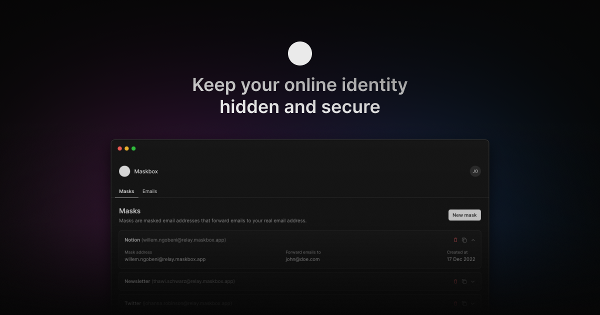

<a href="https://maskbox.app">
  
  <h1 align="center">Maskbox</h1>
</a>

  Maskbox protects your real email addresses from internet strangers and
  automatically forwards messages to your inbox.

  <a href="#introduction"><strong>Introduction</strong></a> ·
  <a href="#built-with"><strong>Built with</strong></a> ·
  <a href="#deployment"><strong>Deployment</strong></a> ·
  <a href="#contributing"><strong>Contributing</strong></a> ·
  <a href="#license"><strong>License</strong></a>

 

## Introduction

[Maskbox](https://maskbox.app) is an open-source tool designed to protect the
privacy of email users by obscuring or altering their email addresses.

By using these masks in place of real email addresses, you can avoid the risk of
your email addresses being harvested by spam bots or other malicious actors,
and can also prevent unwanted solicitations or spam from reaching your
inboxes.

## Built with

- [Next.js](https://nextjs.org)
- [TypeScript](https://typescriptlang.org)
- [tRPC](https://trpc.io)
- [Stitches](https://stitches.dev)
- [PlanetScale](https://planetscale.com)
- [Prisma](https://prisma.io)
- [NextAuth.js](https://next-auth.js.org)
- [Vercel](https://vercel.com/)
- [AWS SES](https://aws.amazon.com/ses)

## Contributing

Contributors are what make the open-source community such an amazing place.
Any contributions you make are appreciated. Here is how you can contribute:

- [Open an issue](https://github.com/maskbox/maskbox/issues) if you believe
  you've encountered a bug.
- [Make a pull request](https://github.com/maskbox/maskbox/pulls) to add new
  features or fix bugs. Before making a pull request, please discuss the change
  you wish to make via issue.

## License

This project is licensed under the AGPLv3. See [`LICENSE`](/LICENSE) for more
information.
